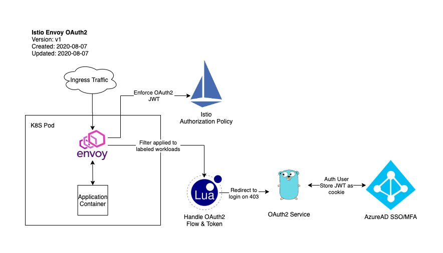

# Istio OAuth2 SSO

A secure, transparent OAuth2 authentication service for Istio service mesh that provides federated SSO for any application without requiring code changes.

## Features

- **🔐 Transparent Token Refresh** - Automatic token renewal without user intervention
- **🛡️ Secure by Design** - Refresh tokens stored server-side, never exposed to clients
- **🔄 Zero-Code Integration** - Works with any application behind Istio
- **🌐 Cross-Domain SSO** - Single sign-on across multiple domains and services
- **⚡ High Performance** - Lightweight with automatic cleanup and efficient operations
- **🔧 Easy Configuration** - Simple JSON configuration with multiple OAuth2 providers

## How It Works

This service sits between your Istio ingress gateway and your applications, handling the complete OAuth2/OIDC flow:

1. **Unauthenticated requests** are redirected to your OAuth2 provider (Azure AD, Google, etc.)
2. **After authentication**, users are redirected back with an authorization code
3. **Access tokens** are stored in secure HTTP-only cookies
4. **Refresh tokens** are stored server-side and linked to user sessions
5. **Token refresh** happens automatically and transparently
6. **Applications receive** the JWT token via the `x-oauth2-sso` header

Your applications never need to handle OAuth2 flows - they just receive authenticated requests with JWT tokens.

## Quick Start

### 1. Basic Usage

Once deployed, users accessing protected applications will be automatically redirected to authenticate. The service handles everything transparently:

```bash
# User visits protected app
curl https://myapp.example.com/dashboard

# Automatically redirected to OAuth provider (Azure AD, Google, etc.)
# After authentication, redirected back to original URL
# Application receives request with JWT in x-oauth2-sso header
```

### 2. Client-Side Integration

For applications that need to handle token refresh or check authentication status:

#### Automatic Token Refresh
```javascript
async function makeAuthenticatedRequest(url, options = {}) {
    let response = await fetch(url, { 
        credentials: 'include', 
        ...options 
    });
    
    // If token expired, automatically refresh and retry
    if (response.status === 401) {
        const refreshResponse = await fetch('/refresh/YOUR_APP_ID', {
            method: 'POST',
            credentials: 'include'
        });
        
        if (refreshResponse.ok) {
            // Retry original request with new token
            response = await fetch(url, { 
                credentials: 'include', 
                ...options 
            });
        } else {
            // Redirect to login
            window.location.href = '/oauth2/YOUR_APP_ID';
        }
    }
    
    return response;
}
```

#### Manual Token Refresh
```javascript
// Refresh token manually
const response = await fetch('/refresh/YOUR_APP_ID', {
    method: 'POST',
    credentials: 'include'
});

if (response.ok) {
    console.log('Token refreshed successfully');
}
```

#### Check Authentication Status
```javascript
// Get current token status
const response = await fetch('/token-status', {
    credentials: 'include'
});

const status = await response.json();
console.log('Session ID:', status.session_id);
console.log('App ID:', status.app_id);
console.log('Has refresh token:', status.has_refresh_token);
```

### 3. Application Integration

Your applications receive the JWT token in the `x-oauth2-sso` header:

```python
# Python Flask example
@app.route('/api/user')
def get_user():
    jwt_token = request.headers.get('x-oauth2-sso')
    if not jwt_token:
        return {'error': 'Not authenticated'}, 401
    
    # Decode and validate JWT
    user_info = decode_jwt(jwt_token)
    return {'user': user_info}
```

```javascript
// Node.js Express example
app.get('/api/user', (req, res) => {
    const jwtToken = req.headers['x-oauth2-sso'];
    if (!jwtToken) {
        return res.status(401).json({ error: 'Not authenticated' });
    }
    
    // Decode and validate JWT
    const userInfo = decodeJWT(jwtToken);
    res.json({ user: userInfo });
});
```

### 4. Logout

```javascript
// Logout user and clear all tokens
window.location.href = '/logout/YOUR_APP_ID';
```

## API Endpoints

| Endpoint | Method | Description |
|----------|--------|-------------|
| `/oauth2/{ID}` | GET | Initiate OAuth2 login flow |
| `/callback` | GET | OAuth2 callback handler |
| `/refresh/{ID}` | POST | Refresh access token transparently |
| `/logout/{ID}` | GET | Logout and clear session |
| `/token-status` | GET | Get current token status |
| `/healthz` | GET | Health check endpoint |

## Security Features

### Transparent Token Refresh

- **Server-side storage**: Refresh tokens never leave the server
- **Automatic renewal**: Tokens refresh transparently without user action
- **Session isolation**: Each user session has independent token storage
- **Background cleanup**: Expired tokens are automatically removed

### Secure Cookie Handling

- **HttpOnly cookies**: Cannot be accessed by JavaScript
- **Secure flag**: Only sent over HTTPS
- **SameSite protection**: CSRF protection
- **Domain scoping**: Cookies scoped to your SSO domain

### Session Management

- **Unique session IDs**: Each user gets a unique session identifier
- **Server-side association**: Session IDs link to stored refresh tokens
- **Automatic expiration**: Sessions expire after 24 hours of inactivity

## Installation & Configuration

### 1. Build and Deploy

```bash
# Build image
docker build . -t docker-registry.example.com/istio-oauth2:latest

# Push to registry
docker push docker-registry.example.com/istio-oauth2:latest

# Deploy to Kubernetes
kubectl apply \
    -f devops/k8s/istio-envoy-filter.yaml \
    -f devops/k8s/secret.yaml \
    -f devops/k8s/deploy.yaml \
    -f devops/k8s/service.yaml
```

### 2. Configuration

#### Environment Variables

```bash
# Required
OAUTH2_CONFIG_FILE=/etc/config/config.json
SESSION_KEY=your-32-byte-or-longer-encryption-key

# Optional
SESSION_STORE_TYPE=cookie  # cookie, redis, or filesystem
SESSION_STORE_REDIS=redis:6379  # if using redis
PORT=8080
```

#### OAuth2 Configuration (`config.json`)

```json
{
  "configs": [
    {
      "ID": "my-app",
      "OAuth2": {
        "ClientID": "your-oauth2-client-id",
        "ClientSecret": "your-oauth2-client-secret",
        "Endpoint": {
          "AuthURL": "https://login.microsoftonline.com/common/oauth2/authorize",
          "TokenURL": "https://login.microsoftonline.com/common/oauth2/token"
        },
        "RedirectURL": "https://your-domain.com/callback"
      },
      "LogoutURL": "https://login.microsoftonline.com/common/oauth2/logout",
      "CookieName": "oauth2_sso",
      "DefaultRedirectURI": "https://your-domain.com",
      "SSODomain": ".your-domain.com"
    }
  ]
}
```

### 3. Istio Configuration

#### Enable OAuth2 for Applications

Label your applications to enable OAuth2 protection:

```yaml
apiVersion: apps/v1
kind: Deployment
metadata:
  name: my-app
spec:
  template:
    metadata:
      labels:
        oauth2sso: enabled  # This enables OAuth2 protection
    spec:
      containers:
      - name: my-app
        image: my-app:latest
```

#### Configure JWT Validation

```yaml
apiVersion: security.istio.io/v1beta1
kind: RequestAuthentication
metadata:
  name: my-app-auth
spec:
  selector:
    matchLabels:
      app: my-app
  jwtRules:
  - issuer: "https://sts.windows.net/YOUR_TENANT_ID/"
    jwksUri: "https://sts.windows.net/YOUR_TENANT_ID/discovery/v2.0/keys"
    fromHeaders:
    - name: x-oauth2-sso
```

### 4. Session Storage Options

#### Cookie Store (Default)
- **Pros**: No additional infrastructure required, stateless
- **Cons**: Cannot revoke sessions centrally, cookie size limits
- **Use for**: Small deployments, development

#### Redis Store
- **Pros**: Central session management, session revocation, horizontal scaling
- **Cons**: Requires Redis infrastructure
- **Use for**: Production deployments, multiple replicas

```bash
SESSION_STORE_TYPE=redis
SESSION_STORE_REDIS=redis-cluster:6379
```

#### Filesystem Store
- **Pros**: Central session management, no additional infrastructure
- **Cons**: Cannot scale horizontally, single point of failure
- **Use for**: Single-instance deployments, testing

```bash
SESSION_STORE_TYPE=filesystem
```

## Advanced Usage

### Multiple OAuth2 Providers

Configure multiple OAuth2 providers for different applications:

```json
{
  "configs": [
    {
      "ID": "azure-app",
      "OAuth2": {
        "ClientID": "azure-client-id",
        "Endpoint": {
          "AuthURL": "https://login.microsoftonline.com/tenant/oauth2/authorize",
          "TokenURL": "https://login.microsoftonline.com/tenant/oauth2/token"
        }
      }
    },
    {
      "ID": "google-app", 
      "OAuth2": {
        "ClientID": "google-client-id",
        "Endpoint": {
          "AuthURL": "https://accounts.google.com/o/oauth2/auth",
          "TokenURL": "https://oauth2.googleapis.com/token"
        }
      }
    }
  ]
}
```

Access different providers:
```bash
# Azure AD login
https://your-domain.com/oauth2/azure-app

# Google login  
https://your-domain.com/oauth2/google-app
```

### Cross-Domain SSO

Enable SSO across multiple domains by configuring the SSO domain:

```json
{
  "SSODomain": ".example.com"  // Works for app1.example.com, app2.example.com, etc.
}
```

### Custom Redirect Handling

Redirect users to specific URLs after authentication:

```bash
# Redirect to specific page after login
https://your-domain.com/oauth2/my-app?redirect=https://your-domain.com/dashboard
```

## Troubleshooting

### Common Issues

#### 1. "No session found" errors
- Check that `oauth2_session_id` cookie is being set
- Verify `SSODomain` configuration matches your domain
- Ensure cookies are not being blocked by browser settings

#### 2. Token refresh failures
- Check that refresh tokens are being stored (call `/token-status`)
- Verify OAuth2 provider supports refresh tokens
- Check server logs for refresh token errors

#### 3. Redirect loops
- Verify `DefaultRedirectURI` is accessible
- Check that applications are properly labeled with `oauth2sso: enabled`
- Ensure Istio EnvoyFilter is applied correctly

### Debug Endpoints

```bash
# Check service health
curl https://your-oauth-service.com/healthz

# Check token status (requires authentication)
curl -b "oauth2_session_id=your-session-id" https://your-oauth-service.com/token-status

# Manual token refresh
curl -X POST -b "oauth2_session_id=your-session-id" https://your-oauth-service.com/refresh/your-app-id
```

### Logging

Enable debug logging by setting log level:

```bash
# In your deployment
env:
- name: LOG_LEVEL
  value: debug
```

## Architecture

This solution relies on native Istio resources and sits between your Istio ingress gateway and your applications:



### How It Works

1. **EnvoyFilter** intercepts requests to protected applications
2. **OAuth2 Service** handles the complete OIDC flow with your identity provider
3. **JWT tokens** are passed to applications via the `x-oauth2-sso` header
4. **Refresh tokens** are stored securely server-side for transparent renewal

## Background

Istio natively supports JWT validation at the edge but doesn't implement the full OIDC flow. This service bridges that gap by:

- Handling OAuth2/OIDC redirects and callbacks
- Managing token lifecycle and refresh
- Providing transparent SSO across multiple applications
- Working with any application without code changes

## Alternatives

This is one approach to implementing SSO in Istio. Other options include:

- **External Authorization Server** - Using Envoy's external auth filter
- **Identity Aware Proxy** - Google Cloud's IAP service
- **Envoy WASM** - Custom WASM filters (when available)

This solution was chosen for its:
- Vendor agnosticism
- Native Istio integration
- Lightweight approach
- Scalable external service design

## Disclaimers and Notes

### Active Development Note

This solution was tested against Istio 1.6 and assumes an intermediate level of understanding with Istio, Envoy, and the OIDC flow. 

As with anything working against bleeding edge technology, RTFM & YMMV.

The API is being improved and optimized. All effort will be taken to ensure breaking changes are properly versioned according to SemVer but please be sure to version your imports out of an abundance of caution.

#### Upcoming Features

This is the first version of this implementation and there are already a few features that are clearly needed. Expect the following list to ebb and flow as more features are defined and subsequently implemented.

If you have a feature request, please raise it as a GitHub issue for proper tracking.

- More intelligent 403 handling
    - Currently if the application returns a `403` to envoy, it will immediately `302` to the IDP.
    - This does not account for valid app-internal `403` errors.
    - Additional logic should be added around the redirect functionality
- Management API
    - Currently, all OAuth2 application configuration is managed with the `config.json` file which is assumed to be injected as a Kuberenetes Secret.
    - However as the list of OAuth2 integrations grows, it will become cumbersome managing a JSON configuration file, patching secrets, restarting pods, etc.
    - While I am generally averse to adding infrastructure / complexity to what is supposed to be a lean interchange process, I can see the long term benefit in some centralized configuration management.
    - Chicken and Egg - how to auth the API which itself manages federated auth configuration
    - For now, using k8s operator RBAC and constructs to manage configuration

### Credits

While I would like to take credit for this design, it would be doing a disservice to the Istio community which I have leaned heavily on to develop this solution.

Thanks to Google and their team who have been a great resource.

Additional thanks to the users in [this GitHub issue](https://github.com/istio/istio/issues/8619) for the EnvoyProxy Lua examples and discussion.

And of course, thanks to my team who have been integral to the Istio design, build, implementation, and testing.

### Contributing

Feature requests, suggestions, and pull requests are welcome. 

However if there is a feature you need immediately, it is recommended that you fork this repo, implement your changes there, and PR back here once your changes are tested and stable in your mesh.