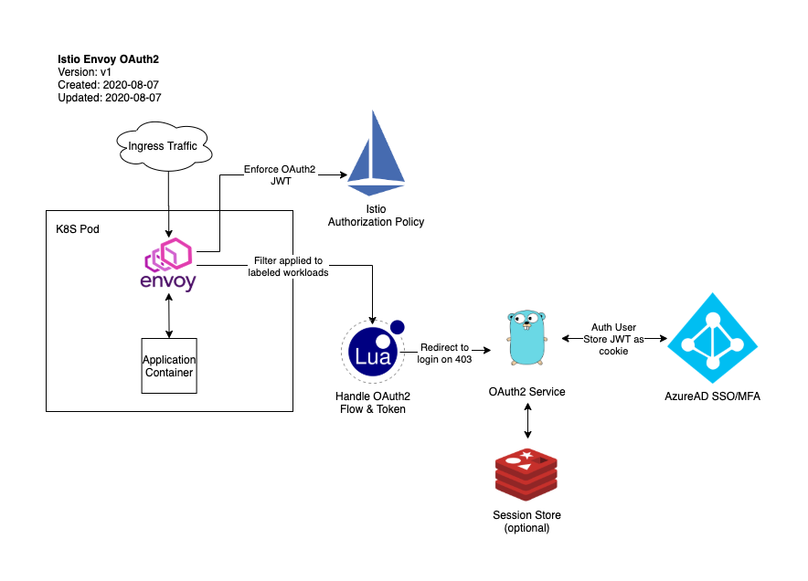

# Istio OAuth2 SSO

A small external API service and Istio `EnvoyFilter` to enable federated OAuth2 authentication / SSO for workloads running inside an Istio service mesh.

## Background

Istio natively supports `JWT` Validation at edge, however currently does not implement the full OIDC flow.

For applications which natively support OIDC an Istio `AuthorizationPolicy` can be used to validate the user's JWT at edge, however if the application does not handle the OIDC lifecycle / flow, Istio cannot natively redirect the user to the IDP, nor can it handle cross-application SSO cookies.

To enable OIDC auth on legacy applications or those which do not natively integrate with a federated IDP, this service and filter will enable Istio mesh operators to enforce an `AuthorizationPolicy` on workloads and handle the full OIDC lifecycle, regardless of the underlying application's support for OIDC.

As Google has stated that native OIDC integration is not on the Istio road map, and the solution developed by IBM relies on the now-deprecated Mixer, this solution aims to be a more generic, lighter weight, and pluggable implementation of OAuth2 using currently-supported native Istio resources and constructs.

## Architecture

This solution relies heavily on native Istio resources as defined in Istio 1.6. 

As the Istio API moves quickly, you may need to make changes to the code to suit your specific Istio environment.



## Alternatives

This is one option of implementing SSO / federated authx in Istio, but is not the only solution.

Salmaan Rashid has a [great write up](https://medium.com/google-cloud/external-authorization-server-with-istio-1159b21682bb) about using an external authentication server pathched into envoy at the ingress gateway to provide a very similar experience.

Google has also suggested the use of [Identity Aware Proxy](https://cloud.google.com/iap/docs/concepts-overview) as a layer above the Istio ingress gateway, however the native Istio and envoy implementation was chosen here for vendor agnosticism and a more native Istio approach.

Google also raised the option of using `envoy-wasm` to provide the required capability entirely within the envoy filter. At the time of writing this, `envoy-wasm` is not merged back into upstream `envoy` and would therefore require building from source and patching all istio clusters to use a custom `envoy-wasm` image. This will probably be a moot point in a few weeks when `envoy-wasm` support is merged to upstream.

However the Lua filter + external API server approach was chosen over `envoy-wasm` to reduce the overhead and latency of the envoy proxy on every request. 

By shifting all of the OAuth logic to a separate scalable service, the envoy lua filter to handle token and redirect logic can remain lean, and the "heavy lifting" of the OAuth process can live independent of envoy.

[This GitHub issue](https://github.com/istio/istio/issues/8619) contains great discussion on this topic and includes a Lua example that is the basis for the Lua envoy filter in this implementation.

## Usage

### Build

```
# build image
docker build . -t docker-registry.example.com/istio-oauth2:latest
# push to registry
docker push docker-registry.example.com/istio-oauth2:latest
```

### Configure

Fill in `devops/k8s/secret.yaml` with your OAuth application information.

Edit `devops/k8s/istio-envoy-filter.yaml` to include your redirect URL for unauthenticated users, and your `workloadSelector` if desired. The default will attach the filter to any Pod labeled `oauth2sso: enabled`.

### Deploy

```
kubectl apply \
    -f devops/k8s/istio-envoy-filter.yaml \
    -f devops/k8s/secret.yaml \
    -f devops/k8s/deploy.yaml \
    -f devops/k8s/service.yaml
```

Create a `VirtualService` according to your mesh configuration to route to your `oauth2-sso` service. This `VirtualService` must be accessible for unauthenticated users, as this is what will handle the user's OIDC flow.

Ensure you have configured your callback URLs in both the API layer and in your OAuth2 provider.

### Mesh Configuration

Once deployed, users trying to access a workload with the `oauth2sso: enabled` label will be redirected to the IDP. After a successful log in, a `oauth2_sso` cookie will be set on the domain defined for the mesh, and the user will be redirected back to the original page.

The `EnvoyFilter` will then take the `oauth2_sso` cookie from the request and modify the request headers to add this as a `x-oauth2-sso` header. 

Your `RequestAuthentication` will need to be configured to use this header. Example:

```
apiVersion: "security.istio.io/v1beta1"
kind: "RequestAuthentication"
metadata:
  name: grafana
  namespace: monitoring
spec:
  selector:
    matchLabels:
      app: grafana
  jwtRules:
  - issuer: "https://sts.windows.net/APP_ID/"
    jwksUri: "https://sts.windows.net/APP_ID/discovery/v2.0/keys"
    fromHeaders:
    - name: x-oauth2-sso
```

#### Auth Header: x-oauth2-sso

The reasoning for using a custom header for the SSO JWT over the default `Authorization: Bearer ...` is to ensure that the SSO token injection does not conflict with existing application authx implementations.

If an application behind this auth layer implements its own authentication scheme, it can continue to do so without conflicting with the additional SSO layer above it.

Additionally, if the application implements its own integration with the same IDP as the top-level SSO this integration provides, the additional authx of the application-specific scopes is a seamless SSO into that role.

## Disclaimers and Notes

### Active Development Note

This solution was tested against Istio 1.6 and assumes an intermediate level of understanding with Istio, Envoy, and the OIDC flow. 

As with anything working against bleeding edge technology, RTFM & YMMV.

The API is being improved and optimized. All effort will be taken to ensure breaking changes are properly versioned according to SemVer but please be sure to version your imports out of an abundance of caution.

#### Upcoming Features

This is the first version of this implementation and there are already a few features that are clearly needed:

- Enable multiple Oauth2 integrations
    - Current implementation only supports a single global OAuth2 integration at IDP session manager API layer.
    - This should be improved so different filters can be created for different IDP configurations, all using the same OAuth2 session API service.
- Mutilple SSO domain support
    - Currently the Oauth2 API layer will only set a single SSO cookie on one domain.
    - API layer should be updated to accept a list of domains, with a small agent running on each domain so that the main API layer can iterate through each domain and set proper SSO cookie
- More intelligent 403 handling
    - Currently if the application returns a `403` to envoy, it will immediately `302` to the IDP.
    - This does not account for valid app-internal `403` errors.
    - Additional logic should be added around the redirect functionality

### Credits

While I would like to take credit for this design, it would be doing a disservice to the Istio community which I have leaned heavily on to develop this solution.

Thanks to Google and their team who have been a great resource.

Additional thanks to the users in [this GitHub issue](https://github.com/istio/istio/issues/8619) for the EnvoyProxy Lua examples and discussion.

And of course, thanks to my team who have been integral to the Istio design, build, implementation, and testing.

### Contributing

Feature requests, suggestions, and pull requests are welcome. 

However if there is a feature you need immediately, it is recommended that you fork this repo, implement your changes there, and PR back here once your changes are tested and stable in your mesh.

